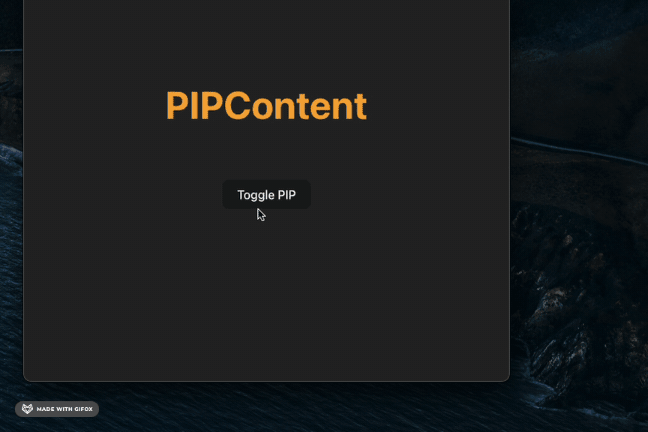

# Vue Document Picture-in-Picture

A Vue 3 component library for creating Picture-in-Picture windows using the Document Picture-in-Picture API.



## Installation

```bash
npm install vue-pip
```

## Usage

### Example

```vue
<template>
  <DocumentPIP
    :isPipOpen="isPipOpen"
    :size="{ width: 500, height: 400 }"
    mode="transfer"
    :copyAllStyles="true"
    @onClose="handleClose"
  >
    <PIPContent />
  </DocumentPIP>
</template>

<script setup lang="ts">
import { ref } from "vue";
import { DocumentPIP, PIPContent } from "vue-pip";

const isPipOpen = ref(false);

const handleClose = () => {
  isPipOpen.value = false;
};
</script>
```

## API Reference

### DocumentPIP Props

| Prop            | Type                     | Default      | Description                                                                      |
| --------------- | ------------------------ | ------------ | -------------------------------------------------------------------------------- |
| `isPipOpen`     | `boolean`                | -            | Controls whether the PIP window is open                                          |
| `size`          | `Partial<PIPWindowSize>` | -            | Size of the PIP window                                                           |
| `mode`          | `'clone' \| 'transfer'`  | `'transfer'` | Content display mode<br>`clone`: keep original + copy<br>`transfer`: move to PIP |
| `copyAllStyles` | `boolean`                | `true`       | Whether to copy all styles to PIP window                                         |

### DocumentPIP Events

| Event     | Description                           |
| --------- | ------------------------------------- |
| `onClose` | Emitted when the PIP window is closed |

### Types

```typescript
interface PIPWindowSize {
  width: number;
  height: number;
}

type Mode = "clone" | "transfer";
```

## Browser Support

This library uses the [Document Picture-in-Picture API](https://developer.chrome.com/docs/web-platform/document-picture-in-picture/), which is currently supported in:

- Chrome 116+
- Edge 116+
- Opera 102+

## License

MIT
